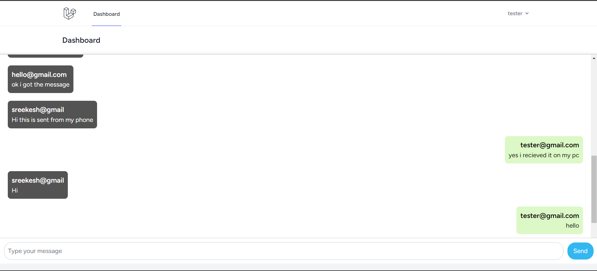

# Laravel + Twilio Chat Room Application

This is a real-time chat room application built using Laravel and Twilio's Conversations API. Users can join the common chat room, send and receive messages, and see real-time updates from all participants in the room. The app utilizes Twilio to handle the message storage, retrieval, and delivery, ensuring a smooth and responsive chat experience.<a href="https://projects/sreekeshkprabhu.me/chat-app">Click here</a> and give it a try! 

## Features

- **Chat Room**: All users join a single, open chat room where they can participate in real-time conversations.
- **Real-time messaging**: Messages are sent and received instantly using the Twilio Conversations API.
- **User Roles**: Messages sent by the logged-in user appear on the right, while messages from other users appear on the left.
- **AJAX Form Submission**: Messages are sent via an AJAX call without refreshing the page.
- **Message History**: When the chat page loads, the previous messages in the conversation are automatically displayed.
- **Responsive UI**: The chat interface is responsive and works on different screen sizes.

## Preview
<p align="center"></p>

## Requirements

- PHP 8.0 or higher
- Composer
- Laravel 9.x
- Twilio account with access to the Conversations API
- MySQL
- Nginx (for deployment)

## Installation

### 1. Clone the repository

```bash
git clone https://github.com/sreekesh-k/Laravel-Chat-App-Twilio.git
```

### 2. Install dependencies

```bash
composer install
npm install (Optional, only if you plan to use Mix)
```

### 3. Configure Environment

Copy the `.env.example` file to `.env` and configure the following settings:

```bash
cp .env.example .env
```

In `.env`:

- Set your Twilio credentials:

```bash
TWILIO_ACCOUNT_SID=XXXXXXXXXXXXXXXXXXXXXXXXXXX
TWILIO_AUTH_TOKEN=XXXXXXXXXXXXXXXXXXXXXXXXXXX
TWILIO_API_KEY=XXXXXXXXXXXXXXXXXXXXXXXXXXX
TWILIO_CHAT_SID=XXXXXXXXXXXXXXXXXXXXXXXXXXX
TWILIO_SERVICE_SID=XXXXXXXXXXXXXXXXXXXXXXXXXXX
TWILIO_API_SECRET=XXXXXXXXXXXXXXXXXXXXXXXXXXX
```

- Set your database connection settings:

```bash
DB_CONNECTION=mysql
DB_HOST=127.0.0.1
DB_PORT=3306
DB_DATABASE=your_database_name
DB_USERNAME=your_database_user
DB_PASSWORD=your_database_password
```

### 4. Generate Laravel App Key

```bash
php artisan key:generate
```

### 5. Run Migrations

```bash
php artisan migrate
```

### 6. Set Up Twilio

Ensure your Twilio Conversations API is correctly configured, and make sure you have the correct conversation SID.

### 7. Serve the Application

```bash
php artisan serve
```

Open your browser at `http://localhost:8000`.

## Usage

### Chat Room Functionality

- All users are automatically added as participants to the chat room upon login.
- Messages sent by the logged-in user appear on the right side of the chat interface, while messages from others appear on the left side.
- Messages are displayed in real-time without the need to refresh the page.

### Sending Messages

1. Log in to the application.
2. Type a message in the input field and click send.
3. The message will appear in the chat room, and other users will see it in real-time.

### File Structure

- `public/js/main.js`: Contains the JavaScript for handling message sending and the Twilio client.
- `public/css/style.css`: Contains the styles for the chat interface.
- `resources/views/dashboard.blade.php`: The main chat view rendered using Blade.

## Deployment

For deployment, you will need:

1. Nginx as the web server.
2. MySQL as the database.
3. Environment variables correctly set on the production server.
4. A cloud hosting provider like DigitalOcean or AWS.

